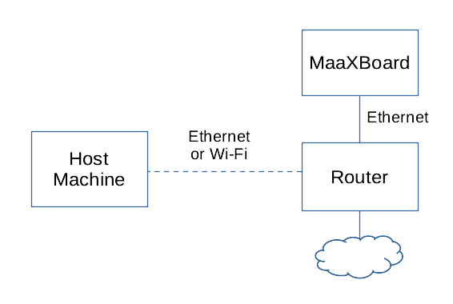

# Boot Loader

## Overview

When a computer is turned off, its software remains stored in non-volatile memory. When the computer is powered on, a bootstrap loader is required: a small, low-level program to configure the computer's memory and devices sufficient to then be able to load further software, such as a bare-metal application or operating system, into RAM and then call it.

**Das U-Boot** (known as "the Universal Boot Loader" and often shortened to U-Boot) is an open-source boot loader commonly used in embedded devices. For such low-level operations, it has to be customised for the hardware on which it is running. As part of this Developer Kit we have provided a U-Boot build suitable for the MaaXBoard.

## Building U-Boot for the MaaXBoard

**Josh**

## Loading the Application

After U-Boot has configured the MaaXBoard's memory and devices, it is able to load an application into RAM and then execute it. It is possible for a user to do this interactively using U-Boot commands via the serial terminal on the host machine. It is also possible and convenient to provide a U-Boot configuration file `uEnv.txt` that runs automatically; both options are documented below.

### Methods of Loading

We cover three primary mechanisms for loading the application into RAM by U-Boot:

- from SD card;
- from USB flash drive;
- via TFTP.

Additional mechanisms are available, such as downloading over the serial cable; however, this would be much slower compared with the options above and is not considered further here. Downloading from on-board flash memory is another possible mechanism, but that is not applicable to the MaaXBoard.

The remainder of this section assumes that you have an application in the form of an executable ELF file called `sel4_image`. We will create this as our test application [later in this documentation](building_applications.md), but this section is concerned with the loading mechanisms rather than the executable itself.

#### Loading from SD Card

The SD card is used to store the boot loader, U-Boot. The SD card may also be used to store the application's ELF file that is to be loaded into RAM by the boot loader. If the SD card is partitioned as described in the [SD Card Preparation](sd_card_preparation.md) section, the `BOOT` partition is used for this.

An advantage of this approach is that it makes use of a single medium that (a) is already being used to store U-Boot and (b) generally has a much larger capacity than is required by U-Boot alone.

A disadvantage is that while U-Boot is a likely to be a relatively unchanging artefact (once it has been configured for a particular computer board), during development the application is likely to be modified repeatedly, and removing, reprogramming, and replacing the SD card is inconvenient and physically stresses the card and its mountings.

#### Loading from USB Flash Drive

The MaaXBoard has two USB 3.0 connectors that U-Boot is able to access, so the application file may be stored on a removable USB flash drive (i.e. thumb/pen drive) and loaded into RAM by U-Boot.

Compared with loading from SD card, this approach has the advantage of leaving the SD card and its U-Boot image undisturbed, although it still involves physical insertion and removal of the flash drive on both the development board and the host machine whenever a new version is to be tested.

#### Loading via TFTP

The MaaXBoard has an Ethernet port that U-Boot is able to access, and the application file may be downloaded from the host machine over TFTP (Trivial File Transfer Protocol), a convenient and popular method for booting.

Connection options include either a direct Ethernet connection between the host machine and the MaaXBoard:

Or a network connection via a router:

Loading via TFTP is considered to be the best method within an application development environment as there is no need keep plugging and unplugging anything from the board.

### U-Boot Commands for Loading

NB tie-in with First Boot section here, so I've started that in parallel...

### U-Boot Configuration File

