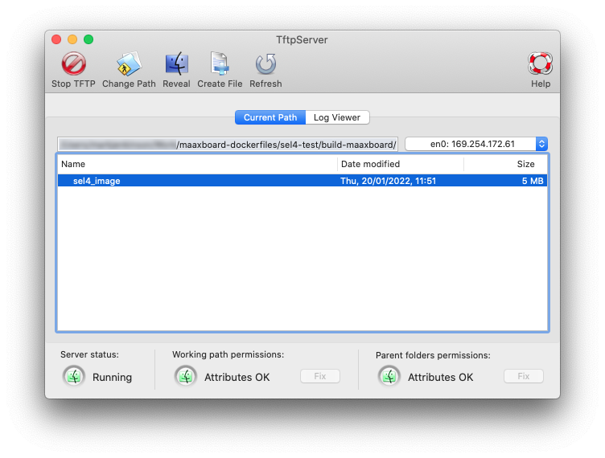
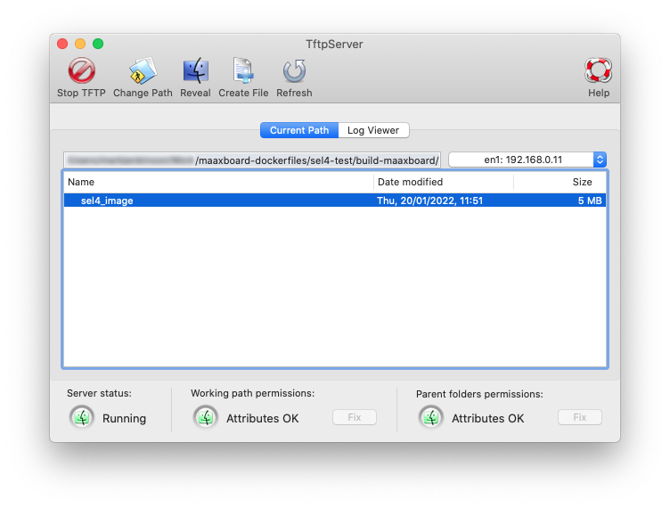

# First Boot

## U-Boot Only

Prerequisites: *Note to self - list/reference other sections*

Note that the serial terminal output does not include the line numbers shown in the example logs shown below; those line numbers have only been added afterwards for ease of reference in this documentation.

### MaaXBoard with no Ethernet Connection

The log below shows the serial terminal output on the host machine when the MaaXBoard boots with no connections or devices other than the SD card containing U-Boot (with no `uEnv.txt` file), a power supply, and the USB to TTL Serial Cable.

```
     1	U-Boot SPL 2021.04-00002-gf752480a4c (Jan 20 2022 - 10:32:23 +0000)
     2	power_bd71837_init
     3	set buck8 to 1.2v for DDR4
     4	DDRINFO: start DRAM init
     5	DDRINFO: DRAM rate 2400MTS
     6	DDRINFO:ddrphy calibration done
     7	DDRINFO: ddrmix config done
     8	Normal Boot
     9	Trying to boot from MMC1
    10	
    11	
    12	U-Boot 2021.04-00002-gf752480a4c (Jan 20 2022 - 10:32:23 +0000)
    13	
    14	CPU:   i.MX8MQ rev2.1 1500 MHz (running at 1000 MHz)
    15	CPU:   Commercial temperature grade (0C to 95C) at 24C
    16	Reset cause: POR
    17	Model: Avnet Maaxboard
    18	DRAM:  2 GiB
    19	MMC:   FSL_SDHC: 0
    20	Loading Environment from MMC... *** Warning - bad CRC, using default environment
    21	
    22	In:    serial
    23	Out:   serial
    24	Err:   serial
    25	
    26	 BuildInfo:
    27	  - ATF d801fd9
    28	
    29	switch to partitions #0, OK
    30	mmc0 is current device
    31	flash target is MMC:0
    32	Net:   
    33	Warning: ethernet@30be0000 (eth0) using random MAC address - 5a:15:1f:fd:43:19
    34	eth0: ethernet@30be0000
    35	Fastboot: Normal
    36	Normal Boot
    37	Hit any key to stop autoboot:  2 ... 1 ... 0 
    38	starting USB...
    39	Bus usb@38100000: Register 2000140 NbrPorts 2
    40	Starting the controller
    41	USB XHCI 1.10
    42	Bus usb@38200000: Register 2000140 NbrPorts 2
    43	Starting the controller
    44	USB XHCI 1.10
    45	scanning bus usb@38100000 for devices... 1 USB Device(s) found
    46	scanning bus usb@38200000 for devices... 1 USB Device(s) found
    47	       scanning usb for storage devices... 0 Storage Device(s) found
    48	
    49	Device 0: unknown device
    50	MMC Device 1 not found
    51	no mmc device at slot 1
    52	MMC Device 2 not found
    53	no mmc device at slot 2
    54	switch to partitions #0, OK
    55	mmc0 is current device
    56	SD/MMC found on device 0
    57	Failed to load 'uEnv.txt'
    58	switch to partitions #0, OK
    59	mmc0 is current device
    60	Failed to load 'boot.scr'
    61	Failed to load 'Image'
    62	Booting from net ...
    63	ethernet@30be0000 Waiting for PHY auto negotiation to
    	complete......................................... TIMEOUT !
    64	Could not initialize PHY ethernet@30be0000
    65	BOOTP broadcast 1
    66	BOOTP broadcast 2
    67	BOOTP broadcast 3
    68	BOOTP broadcast 4
    69	BOOTP broadcast 5
    70	BOOTP broadcast 6
    71	BOOTP broadcast 7
    72	BOOTP broadcast 8
    73	BOOTP broadcast 9
    74	BOOTP broadcast 10
    75	BOOTP broadcast 11
    76	BOOTP broadcast 12
    77	BOOTP broadcast 13
    78	BOOTP broadcast 14
    79	BOOTP broadcast 15
    80	BOOTP broadcast 16
    81	BOOTP broadcast 17
    82	
    83	Retry time exceeded; starting again
    84	ethernet@30be0000 Waiting for PHY auto negotiation to
    	complete......................................... TIMEOUT !
    85	Could not initialize PHY ethernet@30be0000
    86	BOOTP broadcast 1
    87	BOOTP broadcast 2
    88	BOOTP broadcast 3
    89	BOOTP broadcast 4
    90	BOOTP broadcast 5
    91	BOOTP broadcast 6
    92	BOOTP broadcast 7
    93	BOOTP broadcast 8
    94	BOOTP broadcast 9
    95	BOOTP broadcast 10
    96	BOOTP broadcast 11
    97	BOOTP broadcast 12
    98	BOOTP broadcast 13
    99	BOOTP broadcast 14
   100	BOOTP broadcast 15
   101	BOOTP broadcast 16
   102	BOOTP broadcast 17
   103	
   104	Retry time exceeded; starting again
   105	WARN: Cannot load the DT
   106	u-boot=> 
```

The CRC warning at line 20 is not an important issue; it is just an artefact from the basic U-Boot image, and the default environment variables are sufficient.

Once at the U-Boot prompt, you can enter interactive U-Boot commands. For example:

- `printenv` to display the environment variables;
- `setenv` to set environment variables;
- `reset` to reset the CPU instead of physically cycling the power.

There are many more commands (e.g. see [U-Boot commands](https://www.denx.de/wiki/U-Bootdoc/BasicCommandSet)) but we only use a couple of them in this Developer Kit.

### MaaXBoard with Direct Ethernet Connection to Host Machine Running TFTP

If the host machine has an Ethernet port, it may be connected directly to the Ethernet port of the MaaXBoard. The U-Boot log is no different to the previous log, since the MaaXBoard does not have any IP address configuration. However, by setting some environment variables via the U-Boot console, this connection can be established.

1. Identify the IP address of the Ethernet adapter of the host machine to which the MaaXBoard is connected. To establish this as the TFTP server for the MaaXBoard, issue the U-Boot console command `setenv serverip <IP address>` (substituting <IP address> for your own host machine's IP address on this Ethernet adapter).
    - The IP address is available from the macOS/Linux `ifconfig` command or the TFTP Server user interface (i.e. 169.254.172.61 in the screenshot below). Note: this is specific to the direct connection to the MaaXBoard and is unrelated for example to the IP address of the host machine's connection to the LAN network provided by its router (see the example in the next section).



2. Assign an arbitrary IP address to the MaaXBoard within the same subnet, using the U-Boot console command `setenv ipaddress <IP address>`. For example 169.254.172.62 would work in the example above.

3. TFTP transfer of the application file (e.g. `sel4_image`) is then possible using the U-Boot command `tftp ${loadaddr} sel4_image`.
    - Note: `${loadaddr}` accesses an environment variable that is already defined.

### MaaXBoard with Ethernet Connection to DHCP Router

The following log shows the difference when the MaaXBoard boots with the same scenario as previously, except for an Ethernet connection to a router. The router has responded to the MaaXBoard's DHCP request with IP address 192.168.0.56, which automatically sets the environment variable `ipaddr` and the retries and timeout are not needed, shortening the boot sequence.

```
    62	Booting from net ...
    63	BOOTP broadcast 1
    64	BOOTP broadcast 2
    65	DHCP client bound to address 192.168.0.56 (1003 ms)
    66	*** ERROR: 'serverip' not set
    67	Cannot autoload with TFTPGET
    68	BOOTP broadcast 1
    69	BOOTP broadcast 2
    70	DHCP client bound to address 192.168.0.56 (892 ms)
    71	*** ERROR: 'serverip' not set
    72	Cannot autoload with TFTPGET
    73	WARN: Cannot load the DT
    74	u-boot=> 
```
To continue with this scenario: 

1. To resolve the error in lines 66 and 71 of the log above, identify the IP address of the Ethernet adapter of the host machine. To establish this as the TFTP server for the MaaXBoard, issue the U-Boot console command `setenv serverip <IP address>` (substituting <IP address> for your own host machine's IP address on this Ethernet adapter).
    - The IP address is available from the macOS/Linux `ifconfig` command or the TFTP Server user interface (i.e. 192.168.0.11 in the screenshot below). Note: this is different to the previous example as we are using the Wi-Fi Ethernet adapter en1, whose IP address has been allocated by the router.
 


2. As before, TFTP transfer of the application file (e.g. `sel4_image`) is then possible using the U-Boot command `tftp ${loadaddr} sel4_image`.
 
