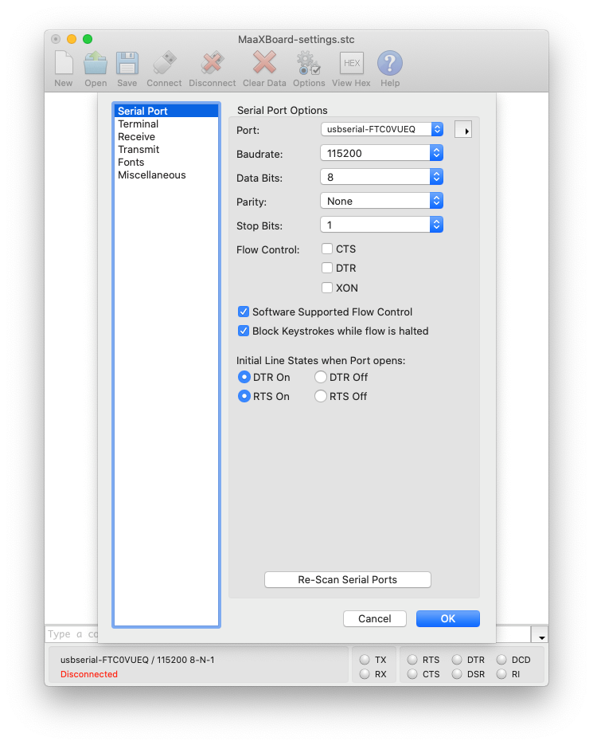

# Host Machine Setup

## Minimum Requirements

This developer kit is intended to have minimal host machine requirements by using Docker containment as much as possible. The following applications are needed on the host machine:

- [Docker](https://www.docker.com/get-started)
    - a Docker container provides the primary development environment
- [balenaEtcher](https://www.balena.io/etcher/) (often known simply as Etcher)
    - used for programming the SD card
- [CoolTerm](https://freeware.the-meiers.org/)
    - used for serial communication with the MaaXBoard

Each of these applications is available for Linux, macOS, and Windows machines. Installation instructions are not reproduced here; please follow the instructions given by the application providers.

If you are a new Docker user, you will have to sign up for an account. Depending on your situation, a subscription fee may be applicable (typically if you are acting as a member of a large commercial organisation), but in many cases there is no cost. This development kit documentation does not attempt to guide you about this; please refer to the licensing conditions on [Docker's website](https://www.docker.com/pricing).

### CoolTerm Configuration

CoolTerm enables the host machine to communicate with the MaaXBoard over the serial interface using the UART pins on the board's GPIO connector (see [Target Platform Setup](target_platform_setup.md) section for more details of the necessary connections). Other applications are available, but this documentation will use CoolTerm, which is freely available and multi-platform.

The configuration parameters are accessible via the _Connection > Options_ menu. The following serial port parameters are required (i.e. 115200 baud, 8 data bits, 1 stop bit):

Note: within the _Port_ field, an appropriate USB port on the host machine should be selected; it may differ from the example shown above in the screenshot.

The following terminal parameters are suggested:

All these settings may be saved for convenience as a CoolTerm configuration file.
