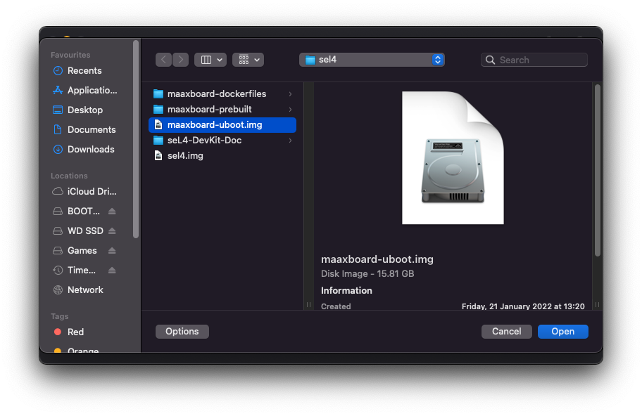
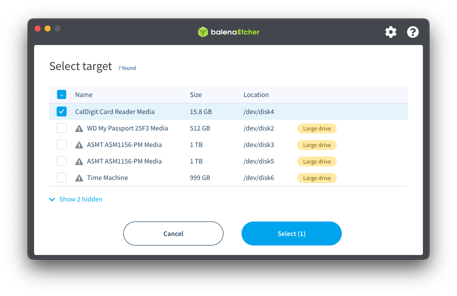
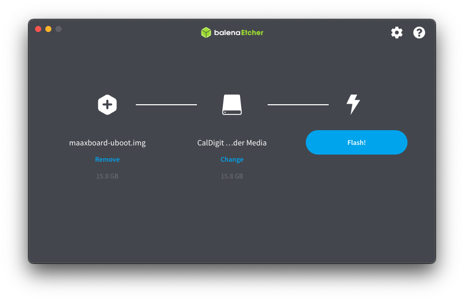
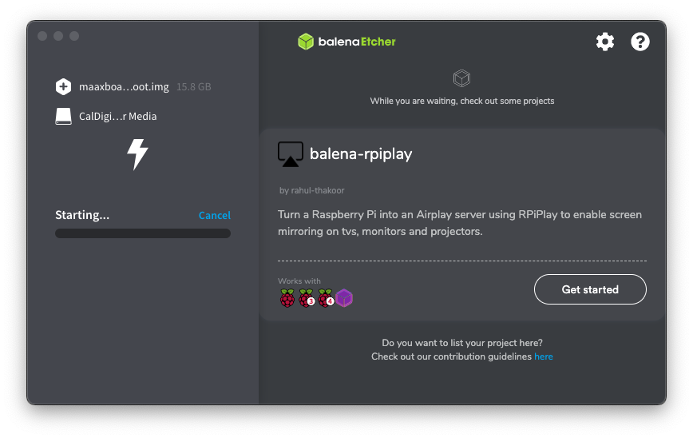
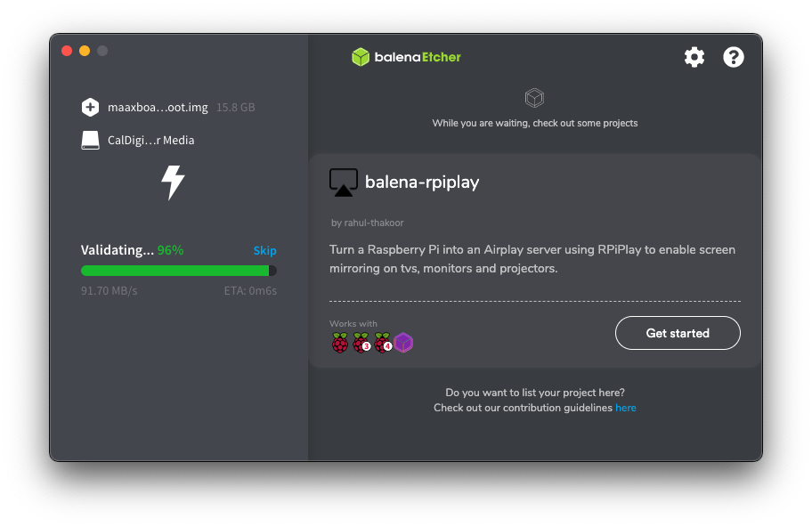

# SD Card preparation

## Using the prebuilt image (recommended)

The SD card must be partitioned correctly in order to contain U-Boot, seL4 and space for a filesystem, for convenience, a prebuilt disk image is provided. _Note: the disk images are set up for a 16GB SD card, please use 16GB or larger._

1. Get the prebuilt disk images from the [maaxboard-prebuilt](https://github.com/sel4devkit/maaxboard-prebuilt) repo, either by cloning the entire repository, or by using GitHub to navigate to
the disk_images folder and selecting the image you want to use, and downloading it through the GitHub interface. Currently two images are available:
    - maaxboard_uboot.img
        - which contains just U-Boot, a U-Boot configuration file in the BOOT partition,  and a filesystem partition.
    - sel4-test-maaxboard-imx8.img
        - which contains U-Boot, a U-Boot configuration file and a prebuilt seL4 test ELF binary in the boot partition.
        
    _Note: the images are compressed as zip files in order to reduce their size (compressed size ~15MB, uncompressed size ~16GB), and will need to be uncompressed using a suitable utility before use._

2. Once you have downloaded the image you wish to use, you will need to use a utility for flashing images to external drives. The rest of this section assumes that you will use balenaEtcher; see the [Host Machine Setup](host_machine_setup.md) section for more details.

3. Insert the SD card you wish to flash, and open balenaEtcher.


4. Select Flash from file, and navigate to and select the image file you wish to flash. Then click open.


5. Click select target and select the drive you wish to flash


6. Then finally click ‘Flash!’ to flash the image.

*Flashing in progress:*

*After Etcher has flashed the disk, it will validate the disk:*


7. Once flashing is complete, the SD card should be ready to accept an ELF binary in the BOOT partition, and ready to use in your Maaxboard. The name of the ELF binary that U-Boot looks for can be configured (see section below on ‘Setting up U-Boot config’)

## Setting up U-Boot config
A U-Boot configuration file is contained within the images provided. It is placed in the root of the  `BOOT`  partition, and should be named 'uEnv.txt'. It contains 3 main configurable items:
1. U-Boot network configuration (ipaddr and netmask): use this to manually configure the IP address and subnet for U-Boot to use, or comment them out too have them assigned by DHCP/BootP.
2. TFTP server IP address: the IP address of the server to use for network boot, should you wish to boot the Maaxboard from a TFTP server.
3. ELF binary name: the name of the ELF binary the U-Boot will try to load, first from a USB device, then a SD card and finally the configured TFTP server. This boot order can be configured a the bottom of the file.  

## Manual Preparation
### Partitioning the SD card
#### macOS Instructions
The SD card must be partitioned correctly in order to contain U-Boot, seL4 and space for a filesystem, this can be done as follows.
1. Insert your SD card into an SD card reader connected to your computer.

2. Find the disk identifier (e.g  `/dev/disk6` ) for your SD card, on macOS this can be done by running `diskutil list` . This command should present a list of disks and their petitions, `/dev/disk0`  and  `/dev/disk1`  are usually used for the internal SSD/HDD on your Mac, so the SD card will usually be at the bottom, assuming it was the last storage device attached to your machine.

3. On macOS, you may need to unmount any volumes associated with the SD card. You can do this either from Disk Utility or by using `diskutil unmount /dev/diskXsY` where `X` is the disk identifier and `Y` is the volume identifier.

4. From terminal run the following command, replacing X in `/dev/diskX` with your disk identifier as found earlier
```
diskutil partitionDisk /dev/diskX 3 MBR \
   FREE Bootloader 10M \
   FAT32 BOOT 256M \
   FAT32 FILESYS R

```
This creates 3 partitions on the disk, a 10 megabyte bootloader partition for U-Boot, a 256 megabyte partition to hold the seL4 image, and finally the remainder of the disk is provided for the file system.

### Writing the Maaxboard U-Boot image to an SD card.
1. If you are continuing on from the partitioning section, skip straight to step 5.
2. Insert your SD card into an SD card reader connected to your computer.
3. Find the disk identifier (e.g  `/dev/disk6` ) for your SD card, on macOS this can be done by running `diskutil list` . This command should present a list of disks and their petitions, `/dev/disk0`  and  `/dev/disk1`  are usually used for the internal SSD/HDD on your Mac, so the SD card will usually be at the bottom, assuming it was the last storage device attached to your machine.
4. On macOS, you may need to unmount any volumes associated with the SD card. You can do this either from Disk Utility or by using `diskutil unmount /dev/diskXsY` where `X` is the disk identifier and `Y` is the volume identifier.
5. Using the terminal, navigate to the folder containing your U-Boot  `flash.bin`  file.
**WARNING: The next step uses the `dd` command line utility, which is used for writing images on to disks. IT WILL OVERWRITE ANY DATA ON THE DISK IT IS SPECIFIED TO WIRTE TO! Improper usage WILL cause data loss, corruption and potentially render your system inoperable. Please ensure you are familiar with the use of the command, as well as the disk identifiers on your system, and that you are writing to the disk you intend to, and not your system drive!**
6. From that folder run the following command: `sudo dd if=flash.bin of=/dev/diskX bs=1k seek=33` , replacing `/dev/diskX` with the disk identifier of your SD card respectively. You may be asked to enter your password.
7. The image should now be written to your SD card and should be bootable by the Maaxboard.