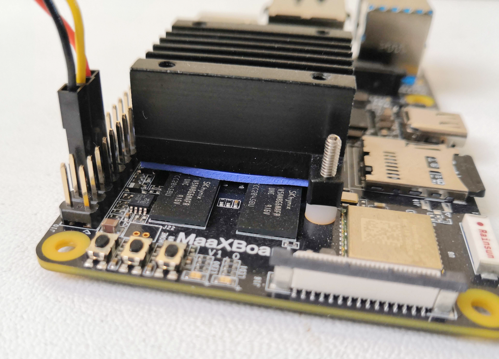

# Target Platform Setup

The Avnet MaaXBoard is packaged in a small box with listed kit contents of:

- 1 x MaaXBoard; and
- 1 x Heat Sink Kit.

Our boards came with the heat sink already attached; however, sales photographs of the board are often shown without the heat sink and it is conceivable that you may have to attach it yourself.

The following shows a plan view of the MaaXBoard with heat sink attached:

For clarity, not all of the components have been labelled, only those to which we are going to refer. Full hardware details are given in the [MaaXBoard Hardware User Manual](https://www.avnet.com/wps/wcm/connect/onesite/1e83cac7-ebe8-4be4-8776-6781e3833d11/MaaXBoard-Hardware_UserManual-V1.2-EN.pdf?MOD=AJPERES&CACHEID=ROOTWORKSPACE.Z18_NA5A1I41L0ICD0ABNDMDDG0000-1e83cac7-ebe8-4be4-8776-6781e3833d11-nVsEcIl), including the full pin-out for the 40-pin GPIO connector, but we only use the three pins that are labelled in red in the photograph. For reference, pin 1 is also labelled in blue and the numbering is as follows:

## Connecting to the MaaXBoard

Communications with the MaaXBoard from the host machine are via the USB-to-TTL serial cable. This converts between the board's 0V and 3.3V logic levels and the 0V and 5V TTL signal levels expected by USB. The USB end plugs into the host machine, and the flying leads are connected to the GPIO pins on the MaaXBoard.

The USB-to-TTL serial cable that we used has 4 flying lead connectors (only 3 of which we use), but some cables have more connectors. The leads shown below in our photographs adhere to a common colour convention, but this should not necessarily be assumed for your cable and should be confirmed before connecting:

- Black = Ground;
- White = Transmit;
- Green = Receive.

The red lead is wired to the USB connector's Vcc 5V power; however, this is not used in our application (the MaaXBoard has its own power supply via the board's USB-C connector) and it has been tied out of the way for convenience in the photographs below.

The final photograph shows the MaaXBoard (anti-clockwise from the top):

- populated with a Micro SD card;
- connected to a power supply (USB-C);
- connected to a USB flash drive (may not be necessary if loading via Ethernet);
- connected to an Ethernet cable (may not be necessary if loading from USB);
- connected to a USB-to-TTL serial cable.

